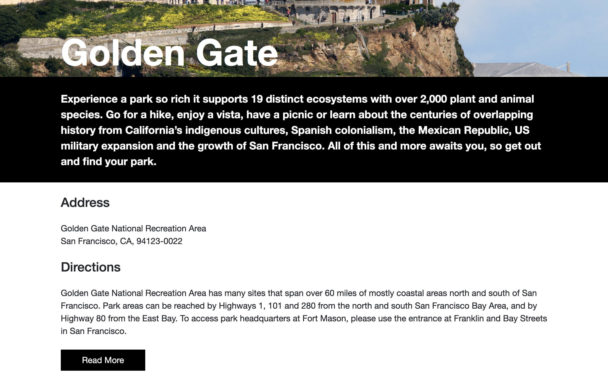

# National Parks

This website displays National Parks and their information. The purpose of this repository is to create a React app that uses react-router and communicates with a 3rd party API. 

[Check out the website here!](https://nationalparks.netlify.com/)

[Click here for the Adobe XD mockup used to create this site.](https://drive.google.com/file/d/1DJS8ysB1N9Kp89_V_loagQiFNU_4jZoN/view?usp=sharing)

## Screenshots

## Built With

* Javascript/ReactJS
* HTML
* CSS/SCSS

## How to Run

1. Fork and clone this repository.
2. Run `npm install` to install dependancies.
3. Run `npm start` to run the React app.

## Contributing

If you have any comments or suggestions please feel free to contact me through github.  

## Future Additions

I would like to improve the loading screen and wait for the images to fully load before being displayed.

## Authors

* Lorenzo Lucas 
